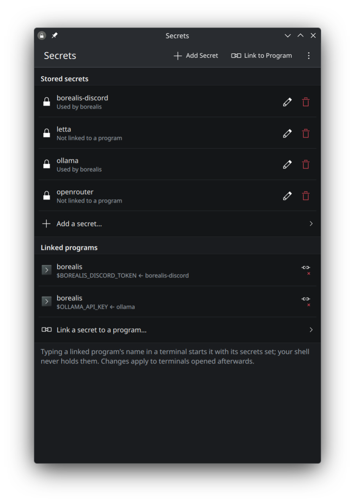

# Secrets

Keep API keys and tokens in your KDE Wallet instead of exporting them from
`~/.bashrc`, and give each one only to the programs that need it.

Exported keys end up in the environment of every process you start, and from
there in process listings, debug logs and tool transcripts. With Secrets, a
linked program gets its key when it starts, and your shell never holds it.



## How it works

- **Secrets** (the app) stores keys in the desktop keyring through the Secret
  Service API, as items with `service=<name>`. They're readable with
  `secret-tool lookup service <name>`.
- Links live in `~/.config/secret-links.conf`, one per line:

  ```
  program VARIABLE secret-name
  ```

- `with-secrets PROGRAM [ARGS...]` looks up the secrets linked to `PROGRAM`,
  exports them, and runs it.
- `shell/secret-links.bash`, sourced from `~/.bashrc`, defines a shell function
  for each linked program, so typing `borealis` runs `with-secrets borealis`.

## Requirements

KDE Plasma 6 with a Secret Service provider (KWallet's `ksecretd`), plus:

- Python 3 with PySide6 and PyGObject (`libsecret` typelib)
- Kirigami and Kirigami Addons
- `secret-tool` (libsecret tools), for `with-secrets`

On Fedora: `python3-pyside6 python3-gobject libsecret kf6-kirigami kf6-kirigami-addons
kf6-qqc2-desktop-style`. Tested on Fedora Kinoite 44 (via Aurora) with Plasma 6.

## Install

```sh
git clone https://github.com/SootyOwl/secrets-manager.git
cd secrets-manager
./install.sh
```

This symlinks `secrets-manager` and `with-secrets` into `~/.local/bin` and adds
the "Secrets" menu entry. Then add to `~/.bashrc` (or `~/.zshrc`):

```sh
. /path/to/secrets-manager/shell/secret-links.bash
```

Inside a distrobox, `secrets-manager` starts the app on the host. Linked
programs work in the container once `secret-tool` is installed there
(`libsecret-tools` on Debian).

## Limits

- Links apply to programs started from a terminal opened after the change, not
  to programs started from the desktop menu.
- A program receives its secrets as environment variables, so anything that
  can read that process's environment can read them.

## License

Public domain, under the [Unlicense](LICENSE).
